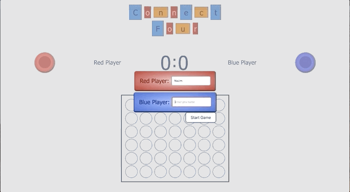

# Connect Four Game
This is a school project that had to be completed in a week.
Connect Four is a game for two in which each player gets a trun and whoever manages to get 4 in a row vertically, 
horizontally or diagonally wins the game.

## Live Demo
Here you can find a live demo: [https://hahiii.github.io/connect-four/](https://hahiii.github.io/connect-four/)

## Setup
This project uses vanilla JavaScript, CSS and HTML.

## Running the project
Clone the repository,  then as there are no dependencies, you can straight away run local host like: python -m http.server 1234
The local server will be then running on localhost:1234